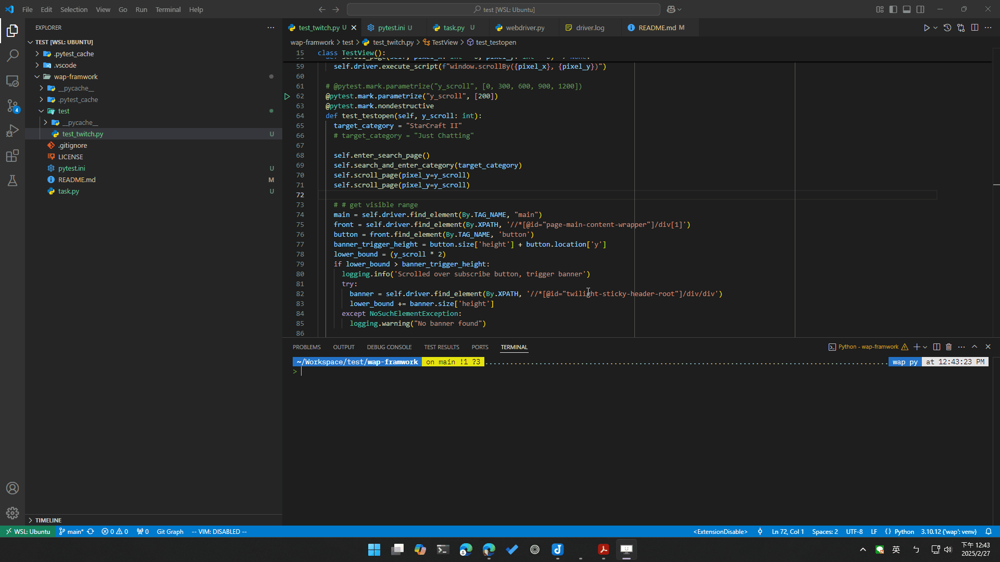
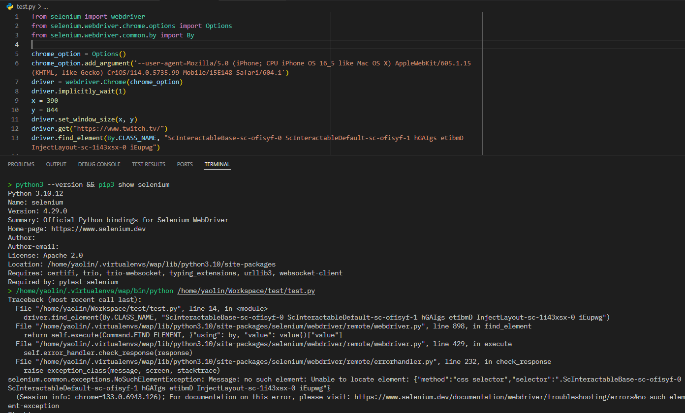

# wap-framework

Framework for WAP testing

## Result

Indivisual Test can be completed below 9 seconds, the demo has a 3 seconds sleep after scrolling for better visuals.

## Framwork

### Goal

For this project's description and requirements, I assumed the test goal was to simulate users browsing Twitch,

### Directory

The test is placed inside the "test" folder, while other files, including pytest.ini, are placed in the first directory.

### Test design

After manually going through the required steps, the test is broken down into these steps:

1. Go to Twitch webpage
2. Enter search page
3. Search the desired category and enter.
4. Scroll twice.
5. Find a Streamer that is visible in the current viewport
6. check if warning information is masked over the content. if the mask is found, click the consent button to continue
7. take screenshot

Considering the availibility and the expandibility of future testcase, all the steps are implemented as functions so that they can be reused by other testcase, except step 5(customed fit for this testcase) and step 7 (selenium package existed function). I will elaborate some of the functions for its design.

#### Scroll behavior

According to the description, the test sould "scroll down 2 times", but there are no details about how much downward is needed. so I implement the scroll length into parametrized variable, which can test different length on the category page.

The implementation of the scroll_page() function has considered the compatibility of different browser drivers. instead of only using the scroll_by_amount() inside the Actionchains object that is only viable for chromium-based browsers, I implemented it with execute_script().

#### Selecting a visible streamer

There are two things to talk about here: the filtering strategy of the visible streamers, and the selection of the streamer.

For the filtering strategy, I found out that the content can not be filtered with isDisplayed() function inside the Webelement object due to its implementation. so I decide to filter with the range of the currently visible content. With the total scrolled length plus the subscribe banner height as the lower-bound, and the lower-bound plus the position of the bottom bar as the upper-bound.

And for the selection of the visible streamer, I think from a user perspective, they will click on whatever they are interested in, so I choose a visible streamer by using random.choice(). I choose to use the title because with logs it is much easier to debug with the text.

## step

1. Go to twitch.
2. Click on the search icon.
3. Input "StarCraft II".
4. Scroll down 2 times.
5. Select one streamer.
6. On the streamer page wait until it is all loaded and take a screenshot.

## Requirements

* Using the Mobile emulator from Google Chrome
* Selenium (python) must be used
* Some streamers will have a modal or pop-up before loading the video, the Auto test case should be able to handle this pop-up.
* (optional) Use pytest as a test runner
* (optional) Description of the structure used in the repository

## Future Improvements

* I encountered a weird bug with selenium 4.29.0 + python 3.10, when I tried to find an element with the class name, it always failed. and the error message shows that Selenium is trying to find the element with the CSS selector.
Here is a screenshot of the error.

After the bug is fixed, I would like to replace some of the find_element() method to using class name, so that it would be more robust.

* Create a driver factory which creates an object that handles implementing the driver itself, and also the frequently used components, like the wait object.
* The filter strategy should also consider the thumbnail as an object.
